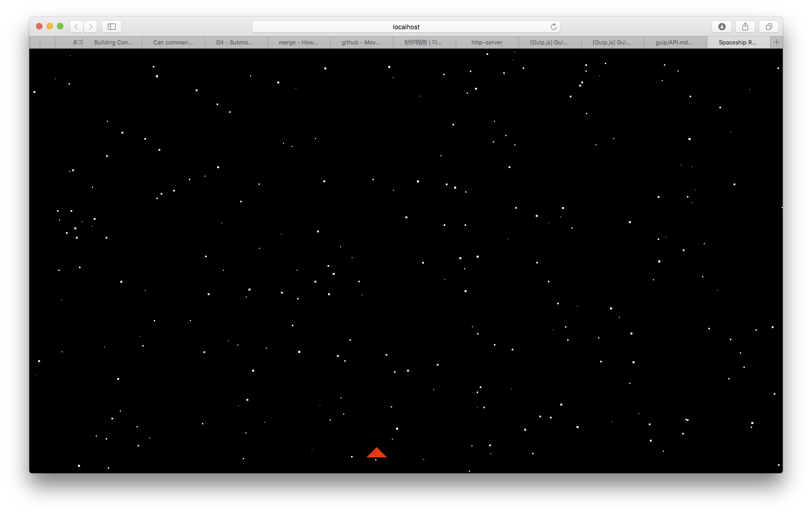

# spaceshipgame-rxjs

Reactive Programming with RxJS
3장에 있는 예제

## 프로젝트 환경설정
- install **node(>= 4.0)(& npm**
https://nodejs.org/en/download/

- install **gulp-cli**
`npm install --global gulp-cli`
https://github.com/gulpjs/gulp/blob/master/docs/getting-started.md
  
- Build Project
Open Terminal & type this command
`gulp`

- Run Project
Open Terminal & type this command
`gulp serve`

- **Webstrom**에서도 Run Configuration을 `gulp`로 맞추고 `Tasks`를 `serve`로 맞추면 실행가능함.

 
- ScreenShot

  
  
